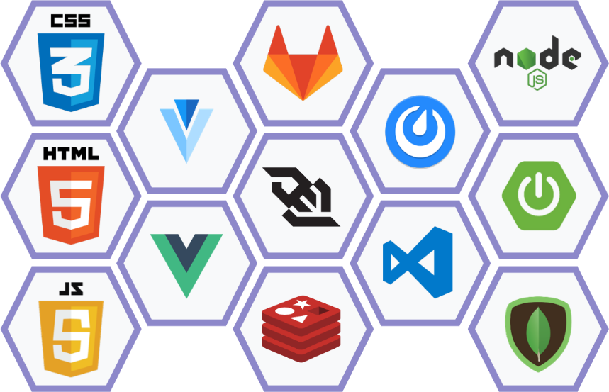

 

# ✨About SSAQUIZ

## ✏개요

**실시간**으로 학생들이 모여, 선생님이 출제한 **퀴즈를 재밌게 풀어나가는** 교육용 플랫폼

 

## 📌기획의도  

​			

​			  Google Trends에서 볼 수 있는 대한민국에서 2019년 12월부터 2021년 4월 현재까지의 **비대면 수업** 관심도 변화입니다. 대부분의 수업이 비대면으로 			전환되면서 교육자들은 원활한 수업을 진행하기가, 학생들은 수업에 온전히 집중하기가 어려워졌습니다. 이 문제를 해결하기 위해 교육자들은 수많은 			온라인 수업 서비스를 시도해보았지만 영어만 지원, 유료 서비스, 사용자 친화적이지 못한 UI/UX 등 불편한 점이 여전히 존재했습니다.

​			  그래서 저희는 실시간 참여 온라인 교육 플랫폼 `SSAQUIZ`를 기획하게 되었습니다. `SSAQUIZ`는 선생님이 출제한 문제를 실시간으로 풀 수 있는 서비스에 			재미요소를 추가한 교육용 플랫폼입니다.

​			(출처 : [google Trends](https://trends.google.co.kr/trends/explore?date=2019-12-01%202021-04-21&geo=KR&q=%EB%B9%84%20%EB%8C%80%EB%A9%B4%20%EC%88%98%EC%97%85) )

 

## ✨ 주요 기능   

* PIN / QR코드를 통한 학생의 퀴즈 참여

* 교육자의 퀴즈 제작
  1. 4지선다
  2. T/F
  3. 순서맞히기
  4. 투표

* 만들어진 퀴즈방에서 퀴즈 진행
  1. 교육자는 학생들에게 퀴즈 페이지를 보여주어 퀴즈를 진행함
  2. 학생은 풀이 페이지를 통해 퀴즈를 풀어나감
  3. 제한 시간이 다 지난 뒤, 교육자는 퀴즈의 정답이 나온 페이지를 보여주고, 학생 개별에게는 정/오답 페이지가 나타남

* 퀴즈가 끝나면 1, 2, 3등 학생의 닉네임을 표시

 

## 🛠기술 스택  

  

## 💫기대효과  

​				✔ 아기자기하고 재미를 유발할 수 있는 UI/UX를 통해, 시험을 치르는 <u>**학생들의 심적 부담감 감소**</u>

​				✔ 학생들이 관심을 가질 만한 <u>**학습자료를 손쉽게 제작**</u>

​				✔ <u>**SSAFY 유튜브 라이브 수업 집중도 향상**</u>

 

## 🤓 프로젝트 산출물  

​				📅 [프로젝트 계획서](https://drive.google.com/file/d/16Q9V0O31joaANPa8tJvnEYdvrmexXm3M/view?usp=sharing)

​				📐 [와이어프레임](https://scene.zeplin.io/project/607e3f1ca51a8398b99605c5)

​				📑 [기능 정의서](https://www.notion.so/jbjb/168b7626ab5b4cd7a515a9475864586d)

​				🤝[Git convention](README.assets/Git.md)

 

## 🐋 팀원 소개  

|  이름   | 역할   | 내용            |
| :-----: | ------ | --------------- |
| 🐬장주빈 | 팀장   | 프론트엔드 개발 |
| 🐟강채원 | 부팀장 | 프론트엔드 개발 |
| 🐠김성진 | 팀원   | 백엔드 개발     |
| 🐡송은주 | 팀원   | 백엔드 개발     |
| 🦐최나현 | 팀원   | 프론트엔드 개발 |
